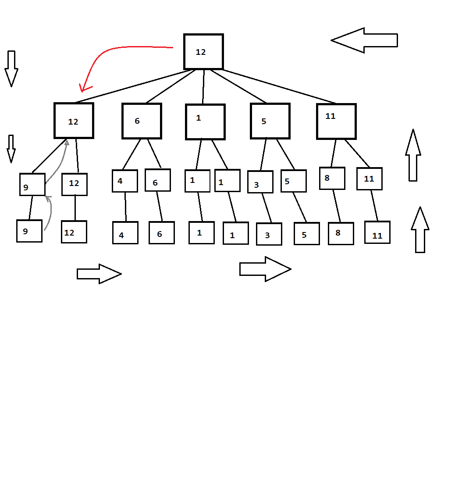

# Go_project_AI
Proyecto dedicado para programar un agente inteligente capaz de resolver la busqueda del camino mas corto y en un laberinto utilizando el tablero del clasico juego Go para simular el laberinto.


## Content of this document

1. <a href="#installation">Installation</a>
2. <a href="#environments">Environments</a>
3. <a href="#Reporte_entrega">Reporte de entrega</a>
4. <a href="#resources">Resources</a>
5. <a href="#contributors">Contributors</a>
6. <a href="#contact">Contact</a>

<a href="#installation"><h2>Installation</h2></a>

Para instalar Go_project_AI primero será necesario instalar el entorno que nos proporciona [[GymGo](https://github.com/aigagror/GymGo)] con los siguientes comandos:
```bash
git clone https://github.com/aigagror/GymGo.git
cd GymGo
pip install -e .
```

La biblioteca de [[GymGo](https://github.com/aigagror/GymGo)] tambien depende de la la biblioteca sklearn, la que se puede instalar con el siguiente comando:
```bash
pip install sklearn
```

Luego instalaremos el proyecto con los siguientes comandos:
```bash
git clone https://github.com/christiangfv/Go_project_AI
cd Go_project_AI
pip install -e .
``` 


<a href="#Ejecucion"><h2>Environments</h2></a>

Para ejecutar el proyecto es necesario correr el programa mazeGo.py el cual busca del archivo maze.py los laberintos a recorrer, los cuales se pueden editar desde el mismo archivo maze.py.
El programa nos mostrará por terminal el algoritmo utilizado para encontrar el camino mas corto, junto con su tiempo de ejecucion y itereaciones realizadas por el algoritmo y el costo del camino encontrado.

Uno de los resultados que se pueden obtener del laberinto 5 es el siguiente:

![Resultados de laberinto 5][images/terminal.png]
![laberinto 5][images/lab5.png]


1. [[GymGo](https://github.com/aigagror/GymGo)]

<a href="#Reporte_entrega"><h2>Reporte de entrega</h2></a>

Utilizando un tablero de Go, se contruyeron diferentes laberintos los cuales fueron resueltos usando 2 algoritmos de búsqueda,
greedy y A-star, ambos son algoritmos de búsqueda bastante parecidos, con la diferencia que A* evaluar el costo de la distancia 
mas corta del nodo actual al destino y tambien evalua el costo del nodo siguiente 
con el nodo de inicio.

Por lo mismo ambos suelen llegar a caminos similares, con la diferencia del numero de iteraciones al ejecutarse, Greedy suele tener
mas iteraciones, ya que recorre mas camino antes de encontrar el indicado.

<a href="#resources"><h2>Reporte de entrega 2</h2></a>

- Implementación de algoritmo predictivo y de decisión de jugadas.
- Menú en terminal con opciones de juego:  IA vs IA o IA vs Persona



<a href="#resources"><h2>recursos</h2></a>

Nos basamos en los siguientes articulos:
[[Greedy/A*](https://es.slideshare.net/AndrewFerlitsch/ai-greedy-and-astar-search)]

Obtuvimos el entorno de este repositorio:
[[GymGo](https://github.com/aigagror/GymGo)]


<a href="#contributors"><h2>Contributors</h2></a>


- Christian Fuentes [[GitHub](https://github.com/igormaraujo/)]
- Jorge fernandez [[GitHub](https://github.com/cafe-tera)]
- Mario Araya F. [[GitHub](https://github.com/k1ltr0h) (Entrega 2)

PD: El codigo fue escrito en conjunto utilizando la extension de vscode live-share
